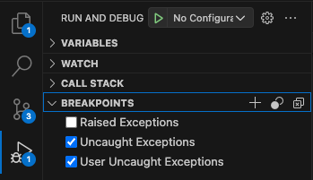

# VSCode Demo

VSCode is a very powerful IDE owned by Microsoft. It has helped me and many of my colleagues to code much more efficiently. It minimizes the need to have many different programs open while developing code, and offers powerful extensions. In this demo I will describe a set of VSCode features that are useful to any developer, and have been particularly useful to me as a Data Scientist. 

### After following along with the demo you will be able to:
* Configure VSCode to get started developing code
* Manage a python environment using conda or docker
* Run python scripts and ipython notebooks
* debug your code
* Use the source control extension
* use the SQLite extension
* Use Github Copilot

## Table of Contents

* Prerequisites
* Environment Management
    * Conda
    * Attaching VSCode Directly to a Docker Container
* Python
    * Running Python Script
    * Running IPython Notebook
    * Debugging Python Script
    * Debugging IPython Notebook
* Source Control Extension
    * Terminal commands
    * User interface
* SQL
    * Set up SQL DB
    * View DB from VSCode
* Github Copilot
    * Setup instructions
    * Copilot examples
* Tips and Tricks
* References

## Prerequisites

1. Install VSCode
2. Clone the repository
    * https://github.com/tchase56/vscode_demo
3. Install Environment Resources
    * Conda Option
        * Install Conda
    * Docker Option
        * Install Docker or Rancher
4. Install VSCode Extensions using extensions button
    * Python Section 
        * Python
    * For Docker Environment Option
        * Docker
        * Dev Containers
    * For SQL
        * SQLite 
        * SQLite Viewer
    * For Copilot
        * GitHub Copilot
        * GitHub Copilot Labs

## Environment Management

### Option 1: Conda

#### Initial Setup

1. Open VSCode
2. Open a terminal
    * A terminal can be spawned by dragging from the bottom of the VSCode screen
3. Create Conda Environment
    * `conda create --name vscode_demo python=3.10.12`
4. Activate the environment
    * `conda activate vscode_demo`
5. Install the necessary python libraries
    * `conda install -c anaconda jupyter=1.0.0`
    * `conda install -c anaconda scikit-learn=1.3.0`
    * `conda install -c anaconda sqlalchemy=1.4.39`
    * `conda install -c anaconda numpy=1.22`
    * `conda install -c anaconda pandas=1.4.3`
    * `conda install -c anaconda ipykernel=6.25.0`
    * `conda install -c anaconda typing=3.10.0.0`
    * `conda install -c conda-forge matplotlib=3.7.2`

#### After Setup

1. Activate the environment
    * `conda activate vscode_demo`

### Option 2: Attaching VSCode Directly to Docker Container

#### Initial Setup

1. Open VSCode
2. Open a terminal
    * A terminal can be spawned by dragging from the bottom of the VSCode screen
3. Build image from Dockerfile
    * `docker image build -t vscode_demo_image .`
4. Build a container from the image
    * `docker run -d -t --name vscode_demo_container vscode_demo_image`
5. Attach VSCode to container
    * click on the docker extension button 
    * open the containers tab
    * right click on vscode_demo_container and select "attach visual studio code"
6. Install the necessary VSCode extensions in the container (same as above)
7. Reconfigure github inside of container (this is needed for interfacing with GitHub from the container)
    * git config
        * `git config user.email "*****"`
        * `git config user.name "****** ******"`
    * if necessary set up your ssh-keychains again

#### After Setup

1. Attach VSCode to container
    * click on the docker extension button 
    * open the containers tab
    * right click on vscode_demo_container and select "attach visual studio code"

### Environment Name for this Demo

It is worth noting that for this demo if you are using the Conda environment workflow your environment will be named vscode_demo. However, if you are using the container environment workflow the default environment is the correct environment. Both python versions are Python 3.10.12. 

## Python

Both the python script and the ipython notebook train a linear regression model that takes two hyperparameters: alpha and l1_ratio. It then displays various performance metrics for both the training set and the test set.

### Running Python Script

1. Open python/python_script.py from the explorer
    * Click on the file explorer button
    * Select VSCODE_DEMO as the home directory of the explorer
    * Open python_script.py

2. Make sure VSCode is using the correct form of Python
    * Open .py file 
        * ensure the language Python is chosen in the lower right hand corner of the screen
        * Click on the python version button in the lower right hand corner of the screen and ensure correct environment is selected

3. Running the script
    * Using the play button 
        * When you open a python script there will be a play button in the upper right hand corner of the screen
            * Press this play button to run the script
            * Note: here you cannot use command line args
    * Terminal Commands
        * A terminal can be spawned by dragging from the bottom of the VSCode screen
            * if there is no terminal put a cursor at the top of the blue ribbon at bottom of VSCode
            * Once the arrow forms click and drag upwards
        * cd into the folder that contains python_script.py
        * Run the terminal command to run the script
            * `python python_script.py <alpha> <l1_ratio>`   
    * Display
        * Plots will not display if a script is ran that contains a plot. 
        * Plots generated in a script must be explicitly saved for later viewing. 

### Running IPython Notebook

1. Open python/python_notebook.ipynb from the explorer

2. Make sure Ipython Notebook is using the correct form of Python
    * Click on the python version button in the top right corner of VSCode and select the correct environment
        * Every notebook has a python environment associated with it

3. Running the notebook
    * Running a single cell
        * Click the play button to the left of the cell
        * or click a cell to highlight, then press shift+enter
    * Running all cells
        * Click the "Run All" button at the top of the notebook

4. Display
    * Print statements and plots will display below the cell being run

### Debugging Python Script

1. Debugger settings
    * Click on the debugger extension button on the left of the window
    * Make sure "Uncaught Exceptions" "User Uncaught Exceptions are checked
        * You may need to run the debugger once before the check boxes show up under the breakpoints tab
    * If there is a spot in your code that you want the debugger to stop at so you can analyze the variables in memory at that point, then add a break point there
        * You can click to the left of a line in the code to add a break point, designated by a red circle

2. Catching a bug placed in imported function
    * Create bug to track
        * in python_functions.py change np.sqrt to np.sqt
    * Debugging python script
        * Click on the debugger extension on the left side of screen
        * click on the script you want to debug
        * Click the down arrow next to the play button
            * select "Debug Python File"
        * the debugger opens the problematic file, highlights the section with the issue (in this case an incorrect function name)

3. Variable exploration while debugging
    * After running debugger and while at a breakpoint
    * VARIABLES tab in the debugger extension 
        * Here you can see the variables in the namespace of the breakpoint
        * When debugging you can right click on the variable and open that variable in the "data viewer" (this is very useful for DataFrames)
        * it is also worth noting that more complicated instances such as class instances are viewable in the VARIABLES tab, with the ability to click through the parameters
    * DEBUG CONSOLE
        * Select the DEBUG CONSOLE at the bottom of the screen next to the TERMINAL button 
        * here you have the ability to query the variables in the namespace of this break point
            * Typing "actual" returns the "actual" argument to the "eval_metrics" function at the time of the break point
    * CALL STACK tab in the debugger extension
        * Often with modular code you will have functions calling functions calling functions
        * By clicking the options under the CALL STACK tab you can navigate that hierarchy that contains your bug
    * Stop debugger
        * Click the stop button at the top of the screen

### Debugging IPython Notebook

1. Debugger Settings
    * follow the instructions for "debugger settings" in the "Debugging Python Script" section
2. Catching a bug placed in imported function
    * Create bug to track
        * in python_functions.py change np.sqrt to np.sqt
    * Debugging IPython Notebook
        * Run all cells to determine the problematic cell
            * in this case the third cell fails
        * At the problematic cell click the dropdown by the play button
        * Select "Debug Cell"
        * The debugger opens the problematic file, highlights the section with the issue, and gives you the ability to query through the debugger at this break point (in this case an incorrect function name)
3. Vairable exploration while debugging
    * follow the instructions for "Variable exploration while debugging" in the "Debugging Python Script" section

## Source Control Extension

### Terminal Commands

1. you can do all of your normal git commands through the terminal at the bottom of the screen
2. stage file
    * `git add <file_name>`
3. commiting changes
    * `git commit -m <commit message>`
4. push changes to repository
    * `git push origin <branch_name>`

### User Interface

1. click on the "source control" extension button on the left side of the window

2. click on a modified file (highlighted yellow) to see the diffs between the current saved version and the last commit
    * how the changes are displayed
        * click on the file in the "source control" extension
        * The old committed file is on the left, and the saved new version is on the right
        * Deletions are highlighted in red and additions are highlighted in green
        * these diffs work for both python scripts and IPython nobebooks
    * Tip
        * I find it helpful to double check the diffs before staging to ensure there isn't anything unexpected (from say a cat on your keyboard...)

3. Stage file
    * click on the "+" button to the right of a file to stage changes

4. commiting changes
    * after staging 
    * type a commit message
    * then click on the blue "commit" button

5. push changes to repository
    * click the three dots at the top of the source control extension
    * select the "push" button

## SQL

### Set up SQL DB

1. Download SQLite
    * Download the SQLite extension in VSCode
    * command+shift+p search and select "Developer: Reload Window"
    * Open sql/mysql.sql
    * In the bottom right of VSCode you may need to clickand select SQLite and mydb.db

2. Create a table in the SQLite DB
    * Create the table by selecting the first command in mysql.sql, right click, and select "Run Selected Query"
        * It may prompt you to choose a DB 
            * If so choose the db from the repo "mydb.db"
        * This creates an empty table named "example_table" in the SQLite DB
    * Populate the table by selecting the second command in mysql.sql, right click and select "Run Selected Query"
3. Query the table we created
    * Query our table by highlighting the third command in mysql.sql, right clicking, and selecting "Run Selected Query"

### View DB from VSCode

1. Download the SQLite Viewer extension in VSCode
    * After setting up our DB and creating the "example_table" table, right click on mydb.db in the Explorer window
        * select "open with..." and then select "sqlite viewer" 
        * here we can see the details of the table we created
        * if there were more tables they would all be available here for viewing
2. This is fairly similar to more complex VSCode DB tools such as the Snowflake extension, or the SQLTools extension

3. Python interface with SQLite DB
    * by running the read_table_from_db_to_pandas.py script we can see how python pulls the data from the db

## Github Copilot

### Setup Instructions

1. Install the GiHub Copilot extension, and connect to your GitHub
2. In your GitHub account sign up for the Copilot trial
    * As of writing the first month is free, then it is $10 a month or $100 per year
3. Configure the data sharing information for GitHub Copilot
    * If you are worried about incorporating public code into your repo I suggest not allowing suggestions matching public code
    * If you are worried about GitHub using your code snippets for training models I suggest you not allow GitHub to use code snippets for product improvement
4. Install the GitHub Copilot Labs Extension
5. If Copilot and/or Copilot Labs is not signed in properly VSCode may prompt you to login
    * If Copilot and/or Copilot Labs isn't connected and VSCode is not prompting you to connect close and re-open the VSCode window

### Copilot Examples

1. Writing code from a comment
    * To recreate the results open copilot/copilot_example.py
        * Delete the code under the comment
        * Put cursor to the right of the comment, hit enter, repeatedly hit tab until the function is complete

2. Automatically generate docstrings
    * To recreate the results open copilot/copilot_example.py
        * Delete the docstring in the "add_inputs" function
        * Put cursor to the right of the first line in the function, hit enter, repeatedly hit tab until the function is complete
        * If the autocompletion isn't going in the direction you want seed it by starting to type what you want and it will update

3. Translating code in GitHub Copilot Labs
    * Example translating pandas to sql
    * To recreate the translation open copilot/copilot_example.py
        * Highlight the section of code where a dataframe is sorted
        * Click on the GitHub Copilot Labs extension
        * Under the "LANGUAGE TRANSLATION" tab select "sql" for "Translate code into", then select the Ask Copilot button

## Tips and Tricks

1. Hover on a function to reveal the docstring

2. Jump to source of function
    * Hold down command and then click a function
        * This will open the source file of that function
3. Jump back to the previous location in the editor
    * If you have jumpted to a function you can quickly jump back
        * You can click go -> back 
        * Or you can press "ctr -"
4. Type in multiple places at once
    * Type on multiple lines (aligned)
        * "option+command+uparrow(or downarrow)"
    * Type on multiple lines (not aligned)
        * "option+click"

5. Open variables in IPython notebook
    * Click on the "Variables" button at the top of the notebook
        * You can see all the variables initialized in the notebook
    * Click on the button to the left of "results_df" to open the Data Viewer

# References

1. Introduction to MLFlow for MLOps Part 2: Docker Environment
    * https://medium.com/p/53516ce45266
2. Configure SQLite for VSCode
    * https://www.google.com/search?q=sqlite+library+vscode&rlz=1C5GCEM_enUS1067US1068&oq=sqlite+library+vscode&aqs=chrome..69i57j33i160.3585j0j7&sourceid=chrome&ie=UTF-8#fpstate=ive&vld=cid:4f8f26c5,vid:JrAiefGNUq8,st:0
3. Setting up SSH Keychains
    * https://docs.github.com/en/authentication/connecting-to-github-with-ssh/adding-a-new-ssh-key-to-your-github-account

